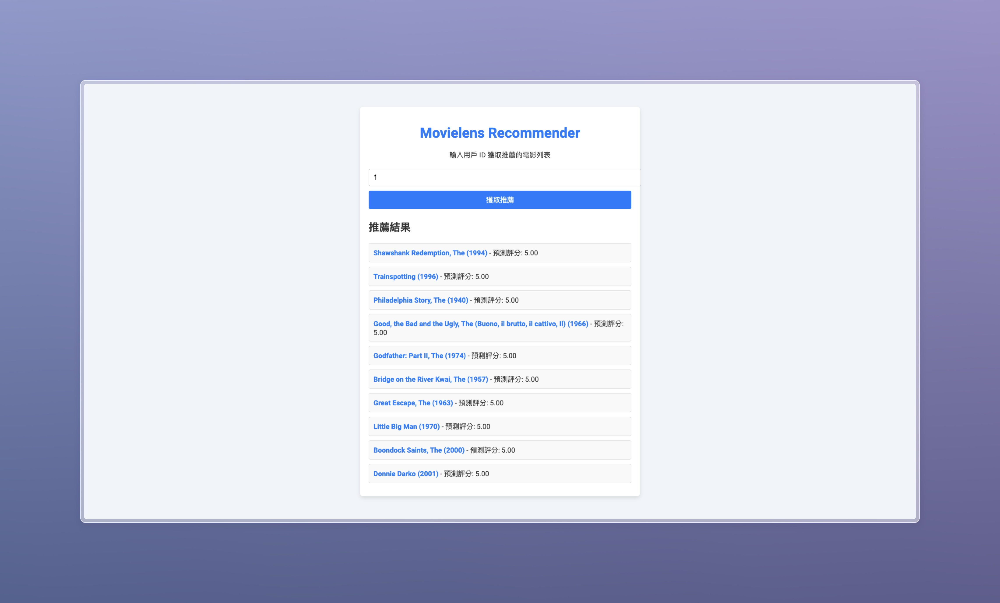

# MovieLens-Recommender



這是一個基於協同過濾技術開發的推薦系統專案，使用 FastAPI 作為後端框架，並在本地和雲端環境中提供推薦服務。此專案旨在展示如何從資料準備到推薦模型訓練，並開發一個 API 提供即時推薦結果。

專案功能

- 推薦 API：基於用戶歷史評分提供個性化的電影推薦。
- 數據前處理：從原始數據集中清理和生成特徵，以便進行模型訓練。
- 模型訓練：使用 Surprise 套件訓練協同過濾模型（如 SVD）。
- FastAPI 開發：構建 API 來提供推薦服務。
- 前端展示：提供一個簡單的 HTML 和 JavaScript 網頁來展示推薦結果。

目錄結構

```bash
project-root/
│
├── app/                         # FastAPI 應用程式資料夾
│   ├── main.py                  # FastAPI 主應用程式代碼
│   ├── utils.py                 # 工具函數和輔助腳本
│   └── models/                  # 模型相關的檔案
│       └── svd_model.pkl        # 已訓練的模型（pickle 檔案）
│
├── data/                        # 數據資料夾
│   ├── ratings.csv              # 評分數據
│   └── movies.csv               # 電影數據
│
├── retraining/                  # 重訓流程相關腳本
│   └── retrain_model.py         # 模型重訓腳本
│
├── docker/                      # Docker 文件夾
│   └── Dockerfile               # Docker 構建文件
│
├── scripts/                     # 自動化腳本
│   ├── deploy.sh                # 部署到 GCP 的腳本
│   └── monitoring.py            # 模型監控腳本
│
├── .github/                     # GitHub Actions 配置
│   └── workflows/
│       └── retrain_and_deploy.yml  # CI/CD pipeline 配置
│
├── index.html                   # 前端展示頁面
├── requirements.txt             # Python 依賴文件
├── README.md                    # 專案說明文件
└── .gitignore                   # Git 忽略規則
```

安裝與使用

1. 安裝依賴

請確保您的環境中已安裝 Python 3.10 或更高版本，並執行以下命令來安裝必要的套件：

```bash
pip install -r requirements.txt
```

2. 運行 FastAPI 應用

使用 Uvicorn 運行 FastAPI 應用：

```bash
uvicorn app.main:app --reload
```

應用將在 http://127.0.0.1:8000 運行。

3. 訪問前端展示頁面

打開 index.html 文件，輸入用戶 ID 並查看推薦的電影列表。

4. Docker 部署

構建並運行 Docker 容器：

```bash
docker build -t recommendation-api .
docker run -p 8000:8000 recommendation-api
```

5. 部署到 GCP Cloud Run

```bash
bash scripts/deploy.sh
```

特性與功能

- 協同過濾模型：使用 SVD 模型來推薦用戶未評分的電影。
- API 開發：使用 FastAPI 提供快速、高效的推薦服務。
- 容器化：提供 Docker 支持，以便於本地測試和雲端部署。
- MLOps 支援：使用 GitHub Actions 和 GCP 工具實現模型的自動重訓和部署。
